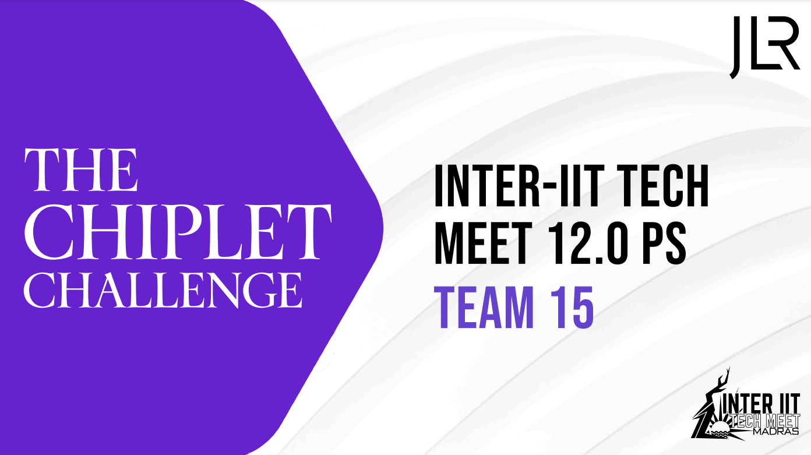

# JLR Chiplet Challenge, Inter IIT 12.0

This is the official project repository for Inter IIT 12.0's [JLR Chiplet Challenge Problem Statement](./PS_High_JLR.pdf) from Electronics Club, IIT Guwahati.

## Reports & Presentation

Please refer to [Mid-submission Report](./JLR_T15_Midsubmission.pdf), [Final Report](./JLR_T15_Final_Report.pdf) and [Presentation](./JLR_T15_Chiplet_Presentation.pdf) within this repo to access the project reports & final presentation.

## Project Files

- [**/MATLAB_Files**](./MATLAB_Files/) contains MATLAB simulation files
- [**/Thermal_Submission**](./Thermal_Submission/) contains the thermal simulation results
- [**/RapidChiplet_Simulation_Results**](./RapidChiplet_Simulation_Results/) contains RapidChiplet simulation results
- [**/Synthesis_Report**](./Synthesis_Report/) contains synthesis results of our neural accelerator and risc chip designs across multiple processes
- [**/Verilog_Files**](./Verilog_Files/) contains verilog source code files

## Inter IIT Results

We were ranked **4th** overall in the Problem Statement, barely missing podium.
